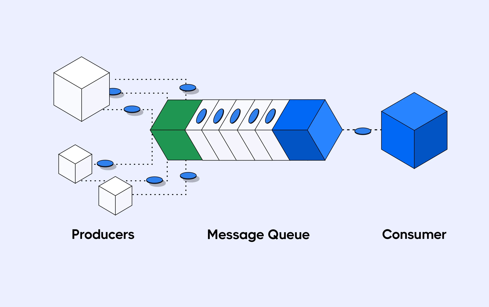

# conQ

Thread safe generic queue in C.

## Why Queue



Message or Task Queues are crucial part of everyday systems we rely on.
Queues are popularly used for decoupling large systems and thus increase system reliability.
The artefacts produced by one system is safely consumed by another components at its own pace.

In this small experimental project, we aim to implement a simple yet efficient, generic thread-safe queue in C from scratch.

## Project Structure

- `queue.h` contains the function definitions and structures
- `queue.c` hosts our actual implementation
- `test.c` has our automated tests to check whether our implementation supports thread-safety and any data structure

## Testing

Simply compile all the files using the given Makefile and execute the `test` file.

```shell
make
./test
```
